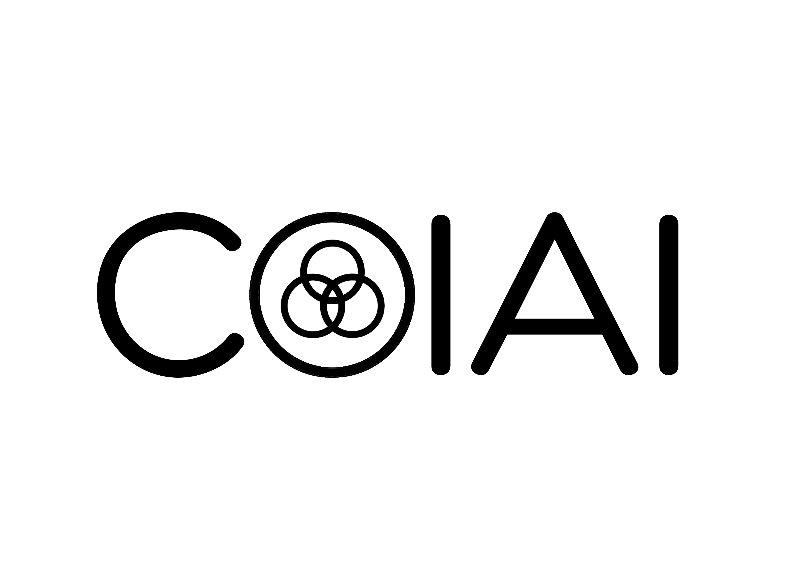

 

# Welcome to ColAI!

[**ColAI**]() stands for **Col**laborative **A**rtificial **I**ntelligence for All. We aim to build a reciprocal and collaborative community of shared interest for Artificial General Intelligence (AGI).

## Updates

* **[05/30/2023]** :tada: We are excited to announce the release of the first version of [ColDA](https://github.com/Collaborative-AI/colda).
* **[12/01/2022]** We have published [Gradient Assisted Learning](https://openreview.net/forum?id=MT1GId7fJiP) at NeurIPS 2022. This work enables decentralized participants to collaborate effectively.
* **[06/01/2021]** The development of [ColAI](https://github.com/Collaborative-AI) has officially commenced.
* **[12/01/2020]** We have published [Assisted Learning](https://proceedings.neurips.cc/paper/2020/hash/a7b23e6eefbe6cf04b8e62a6f0915550-Abstract.html) at NeurIPS 2020 (Spotlight).

## Features

- [ColDA](https://github.com/Collaborative-AI/colda) is an open-source project that provides Distributed Machine Learning tools for data analysis and machine learning based on [Assisted Learning](https://assisted-learning.org/).

# Join Our Community

We invite you to contribute and shape the future of Artificial General Intelligence (AGI)!

* Connect with us on [Slack](https://join.slack.com/t/colai/shared_invite/zt-1uokr3rlg-t1uHUFzXroCaSbC4XKeiMQ).
